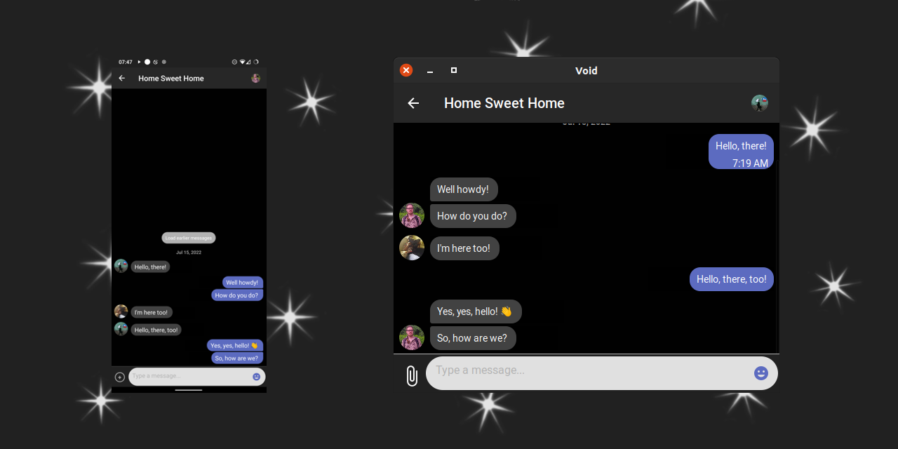

# Void

Welcome to Void, a decentralized, private, and secure
messenger for the 21st century.

-----
Alpha Warning: Void is alpha-quality software built on
alpha-quality libraries. While it works most of the time,
crashes and data loss are to be expected.

Do not use for anything other than testing.

------

Void aims to be a social network for the modern age.
One that doesn't track you, lock you in, or make you
the product.

While that is the ultimate goal, right now Void is just
a messenger. You can chat with peers as long as you
know their identity public key. On mobile this is
a `screamingvoid://peer/{64 char hex string}` URI
that you can open and the app will pick it up.
Handling custom URI's on desktop is a little trickier
without installation, so the preview app does not
currently do it.

You can find the preview apps on the releases page.

If you wish to see Void achieving it's goals and
growing consider sponsoring me, the primary and for
now, only, developer. Developing Void is very time consuming and there's lots of work to be done, as
the stack Void is built around does not support
environments outside of node.js, so just getting
the app to run on mobile involves considerable amount
of work and lots of native code.

If you decide to become a sponsor you can see available
options to support me in the sidebar. Currently you
become a patron on Patreon for recurring donations or
alternatively use DonorBox to support me.

For more information about available features, known
bugs, and things to come check individual packages in
the source tree.

Most packages in this monorepo are released under MIT
license, and every package includes LICENSE file you
can double check.

Some packages may be missing readmes. Documenting
things is important but time consuming, and at this
stage in development requires many rewrites as things
break and change often. I'll get to it eventually.
